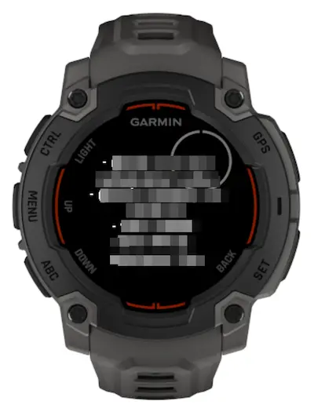

# garmin-todotxt

Because I use todotxt, and I want the convenience of checking today's tasks from my garmin.

API endpoint is from [this repo](https://github.com/kahnwong/todotxt-api), but you can write your own that return following api response:

```json
[
  { "id": 1, "todo": "foo" },
  { "id": 2, "todo": "bar" }
]
```

Or alternatively, you have to adjust the source code in this repo to support your custom api response format.

## Pre-reqs

To specify apiEndpoint and apiKey, fill in the values here: `./resources/properties.xml`.

## Screenshot


